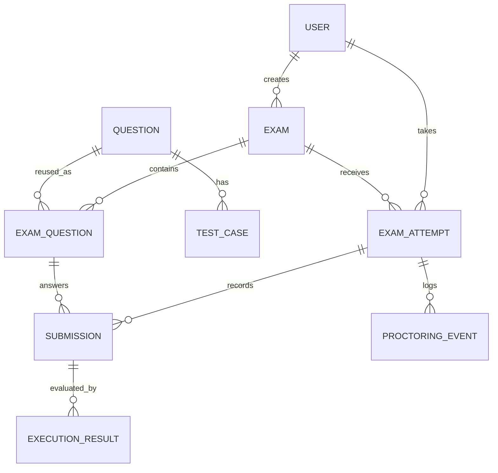

# Barabari LiveCode — Database Design v1

**Version:** 1.0  
**Status:** Proposed MVP schema  
**Database:** PostgreSQL  
**ORM:** Prisma  
**Scope:** Algorithmic coding exams, server-authoritative attempts/timers, submissions, automated grading, and basic browser-event logging.

This document defines the initial relational model. It is a design baseline, not yet a Prisma schema or migration.

## 1. Decisions locked for v1

- **One attempt per student per exam.** Enforce this with a unique constraint on `(exam_id, student_id)`.
- **Questions are reusable.** A question bank can supply a question to multiple exams through `exam_questions`.
- **Run Code and Submit are different operations.** A code run is not a permanent submission. Run results may be transient initially; persistent run history can be added later if needed.
- **Best submission counts.** For each question in an attempt, the effective score is the highest successfully graded submission score. Earlier submissions remain stored for audit/history.
- **AI webcam/eye-tracking is out of MVP.** `proctoring_events` stores basic browser signals only; signals are not proof of cheating.
- **The server is authoritative.** The server determines attempt status, deadline, submission eligibility, and score.

## 2. ER model



### Relationship cardinality

- One **User** with role `INSTRUCTOR` can create many **Exams**.
- One **Exam** contains many **ExamQuestions**.
- One **Question** can be included in many exams through **ExamQuestion**.
- One **Question** has many **TestCases**.
- One **Exam** has many **ExamAttempts**, one per participating student.
- One **User** with role `STUDENT` can have many **ExamAttempts** across different exams.
- One **ExamAttempt** can have many **Submissions**.
- Each **Submission** answers one `ExamQuestion` within that particular exam.
- One **Submission** can have multiple **ExecutionResults**, allowing retries/rejudging by the judge without overwriting the submission.
- One **ExamAttempt** can have many **ProctoringEvents**.

## 3. Tables

Names below use snake_case for SQL. Prisma model names will typically be singular PascalCase and map to these table names.

### 3.1 `users`

Stores all platform accounts.

| Column | Type (conceptual) | Rules |
|---|---|---|
| `id` | UUID | Primary key |
| `name` | VARCHAR | Required |
| `email` | VARCHAR | Required; unique; normalize before storing |
| `password_hash` | VARCHAR | Required; never store plaintext passwords |
| `role` | ENUM | `STUDENT`, `INSTRUCTOR`, `ADMIN` |
| `created_at` | TIMESTAMPTZ | Required; default current timestamp |
| `updated_at` | TIMESTAMPTZ | Required |

**Constraints and notes**
- `email` must be unique.
- Authorization must be checked on the server; hiding UI controls is not authorization.
- Organization/cohort membership is not modeled in v1. Add it when institution/cohort assignment becomes a concrete MVP requirement.

### 3.2 `exams`

Stores the exam definition, not any individual student's progress.

| Column | Type (conceptual) | Rules |
|---|---|---|
| `id` | UUID | Primary key |
| `title` | VARCHAR | Required |
| `description` | TEXT | Optional |
| `duration_seconds` | INTEGER | Required; greater than zero |
| `starts_at` | TIMESTAMPTZ | Optional, depending on scheduling policy |
| `ends_at` | TIMESTAMPTZ | Optional |
| `status` | ENUM | `DRAFT`, `PUBLISHED`, `CANCELLED`, `ENDED` |
| `created_by` | UUID | FK → `users.id` |
| `created_at` | TIMESTAMPTZ | Required |
| `updated_at` | TIMESTAMPTZ | Required |

**Constraints and notes**
- `duration_seconds > 0`.
- If both schedule boundaries are present, `ends_at > starts_at`.
- Only an authorized instructor/admin can create or manage an exam.
- Publish/start eligibility is enforced in backend business logic, not solely by the frontend.
- `starts_at` and `ends_at` describe the allowed exam window; an attempt's `expires_at` describes that student's deadline. They are not interchangeable.

### 3.3 `questions`

The reusable question bank. Contains the problem statement and default programming configuration.

| Column | Type (conceptual) | Rules |
|---|---|---|
| `id` | UUID | Primary key |
| `title` | VARCHAR | Required |
| `description` | TEXT | Required |
| `constraints` | TEXT | Optional |
| `input_description` | TEXT | Optional |
| `output_description` | TEXT | Optional |
| `starter_code` | JSONB or TEXT | Optional; choose one representation consistently |
| `default_language` | VARCHAR / ENUM | Optional |
| `time_limit_ms` | INTEGER | Required; greater than zero |
| `memory_limit_mb` | INTEGER | Optional; positive when set |
| `created_by` | UUID | FK → `users.id` |
| `created_at` | TIMESTAMPTZ | Required |
| `updated_at` | TIMESTAMPTZ | Required |

**Constraints and notes**
- `time_limit_ms > 0`; `memory_limit_mb > 0` when not null.
- Keep public sample examples separate from hidden grading cases if their behavior differs.
- Language-specific starter code may eventually need a JSON object keyed by language. Do not overbuild this until the editor/execution flow requires it.
- **Published-exam integrity:** changing a shared question or its test cases can change the meaning of an existing exam. For v1, lock question/test-case edits once used by a published exam, or require an explicit clone/new question. Full versioning can be added later.

### 3.4 `exam_questions`

The join table linking a reusable question to an exam. It is not another question.

| Column | Type (conceptual) | Rules |
|---|---|---|
| `id` | UUID | Primary key |
| `exam_id` | UUID | FK → `exams.id` |
| `question_id` | UUID | FK → `questions.id` |
| `position` | INTEGER | Required; one-based order |
| `points` | NUMERIC or INTEGER | Required; non-negative |
| `created_at` | TIMESTAMPTZ | Required |

**Constraints and notes**
- Unique `(exam_id, question_id)` prevents the same question from being added twice to the same exam in v1.
- Unique `(exam_id, position)` prevents duplicate question positions.
- `position > 0`; `points >= 0`.
- Store exam-specific marks/order here, rather than on `questions`, because the same question may be worth different marks in different exams.
- A submission references `exam_questions.id`, not only `questions.id`, so it is tied to the exact question placement in that exam.

### 3.5 `test_cases`

Input/output cases used by the grading engine.

| Column | Type (conceptual) | Rules |
|---|---|---|
| `id` | UUID | Primary key |
| `question_id` | UUID | FK → `questions.id` |
| `input_data` | TEXT | Required; may be empty for some problems |
| `expected_output` | TEXT | Required |
| `visibility` | ENUM | `PUBLIC`, `HIDDEN` |
| `weight` | NUMERIC or INTEGER | Required; non-negative; default 1 |
| `position` | INTEGER | Required |
| `created_at` | TIMESTAMPTZ | Required |

**Constraints and notes**
- `position > 0`; `weight >= 0`.
- Unique `(question_id, position)`.
- Never return hidden inputs/expected outputs to the student-facing API.
- Normalize output comparison rules in the judge service (for example, trailing whitespace) rather than duplicating them across endpoints.
- If tests need language-specific behavior or custom validators later, extend this model deliberately.

### 3.6 `exam_attempts`

One row represents one student's participation in one exam.

| Column | Type (conceptual) | Rules |
|---|---|---|
| `id` | UUID | Primary key |
| `exam_id` | UUID | FK → `exams.id` |
| `student_id` | UUID | FK → `users.id` |
| `started_at` | TIMESTAMPTZ | Nullable until started |
| `expires_at` | TIMESTAMPTZ | Nullable until started |
| `submitted_at` | TIMESTAMPTZ | Nullable |
| `status` | ENUM | `NOT_STARTED`, `IN_PROGRESS`, `SUBMITTED`, `AUTO_SUBMITTED`, `DISQUALIFIED`, `EXPIRED` |
| `created_at` | TIMESTAMPTZ | Required |
| `updated_at` | TIMESTAMPTZ | Required |

**Constraints and notes**
- Unique `(exam_id, student_id)` enforces one attempt per student per exam.
- `expires_at` is computed by the server when the attempt starts, usually `started_at + duration_seconds`, and is stored to keep the deadline stable.
- The server checks the current time against `expires_at` before accepting actions/submissions. Never trust a client-side countdown.
- `NOT_STARTED` attempts may be created when assigning students or lazily when they open the exam. Pick one approach and use it consistently.
- Do **not** store a mutable `score` here as the source of truth in v1. Derive the total from each exam question's best graded submission, or introduce a score summary/cache later if query performance requires it.
- A unique constraint prevents multiple attempts; retakes would require an explicit product/schema change.

### 3.7 `submissions`

An immutable record of code submitted for grading. Each retry creates a new row.

| Column | Type (conceptual) | Rules |
|---|---|---|
| `id` | UUID | Primary key |
| `attempt_id` | UUID | FK → `exam_attempts.id` |
| `exam_question_id` | UUID | FK → `exam_questions.id` |
| `code` | TEXT | Required |
| `language` | VARCHAR / ENUM | Required |
| `submitted_at` | TIMESTAMPTZ | Required |
| `created_at` | TIMESTAMPTZ | Required |

**Constraints and notes**
- Validate that the `exam_question_id` belongs to the same exam as the referenced attempt. A normal FK cannot enforce this cross-table rule alone; enforce it in a transaction/service, or redesign with a composite key if needed.
- A submission must only be accepted while its attempt is `IN_PROGRESS` and before `expires_at`, unless the server is performing the defined auto-submit flow.
- Preserve each submission's code; do not overwrite it when the student submits again.
- The student identity is obtained through `attempt_id → exam_attempts.student_id`; don't duplicate `student_id` here.
- A separate `RUN`/play action does not create a `submissions` row. In v1, run output can be returned transiently. Persistent run history is a future feature.

### 3.8 `execution_results`

Records an evaluation of a specific submission. Multiple rows can exist if a submission is rejudged or evaluation is retried.

| Column | Type (conceptual) | Rules |
|---|---|---|
| `id` | UUID | Primary key |
| `submission_id` | UUID | FK → `submissions.id` |
| `status` | ENUM | `QUEUED`, `RUNNING`, `ACCEPTED`, `WRONG_ANSWER`, `TIME_LIMIT_EXCEEDED`, `MEMORY_LIMIT_EXCEEDED`, `COMPILATION_ERROR`, `RUNTIME_ERROR`, `INTERNAL_ERROR` |
| `score` | NUMERIC | Required when grading completes; bounded by the question's configured points at the application layer |
| `total_tests` | INTEGER | Required when complete; non-negative |
| `passed_tests` | INTEGER | Required when complete; non-negative and no greater than total |
| `execution_time_ms` | INTEGER | Optional; non-negative |
| `memory_used_kb` | BIGINT | Optional; non-negative |
| `judge_reference` | VARCHAR | Optional external judge submission/token ID |
| `created_at` | TIMESTAMPTZ | Required |
| `completed_at` | TIMESTAMPTZ | Nullable until complete |

**Constraints and notes**
- `passed_tests <= total_tests`.
- Do not store hidden test inputs/expected outputs in this table.
- Limit access to compiler/runtime output because it may contain sensitive or unexpectedly large content. If output fields are added, apply strict size limits.
- `score` should be interpreted against the marks for the associated `ExamQuestion`; keep score units consistent (for example, points rather than percent).
- The best-submission score is the maximum score from completed, valid graded submissions for the same `(attempt_id, exam_question_id)`. Ignore queued/running/failed internal evaluations when calculating the best score.
- Decide whether an infrastructure `INTERNAL_ERROR` is retryable and whether it counts as a student's attempt; it should not unfairly lower their score.

### 3.9 `proctoring_events`

Basic browser-level activity logs only; no AI camera analysis in MVP.

| Column | Type (conceptual) | Rules |
|---|---|---|
| `id` | UUID | Primary key |
| `attempt_id` | UUID | FK → `exam_attempts.id` |
| `type` | ENUM | e.g. `TAB_HIDDEN`, `FULLSCREEN_EXIT`, `WINDOW_BLUR`, `COPY_ATTEMPT`, `PASTE_ATTEMPT`, `CONTEXT_MENU` |
| `occurred_at` | TIMESTAMPTZ | Required; server-received timestamp should be recorded |
| `metadata` | JSONB | Optional, size-limited, and must not contain unnecessary personal data |

**Constraints and notes**
- Index by `(attempt_id, occurred_at)` for an attempt's timeline.
- Client-provided timestamps can be included as untrusted metadata, but the server's receive time is authoritative.
- Repeated focus/blur events should be debounced or filtered to avoid noisy event floods.
- These events are signals, not proof of cheating. Avoid automatic disqualification solely from one unreliable browser signal.

## 4. Indexes and uniqueness

Create these indexes/constraints intentionally:

| Table | Index / constraint | Why |
|---|---|---|
| `users` | Unique `(email)` | Login identity |
| `exams` | `(created_by, status)` | Instructor's exam list |
| `exam_questions` | Unique `(exam_id, question_id)` | No duplicate question in one exam |
| `exam_questions` | Unique `(exam_id, position)` | Stable question ordering |
| `test_cases` | Unique `(question_id, position)` | Stable test ordering |
| `exam_attempts` | Unique `(exam_id, student_id)` | One attempt per student/exam |
| `exam_attempts` | `(exam_id, status)` | Instructor's live exam view |
| `exam_attempts` | `(student_id, created_at)` | Student's exam history |
| `submissions` | `(attempt_id, exam_question_id, submitted_at)` | Question submission history |
| `execution_results` | `(submission_id, created_at)` | Find evaluation history/latest result |
| `proctoring_events` | `(attempt_id, occurred_at)` | Event timeline |

PostgreSQL automatically creates indexes for primary keys and unique constraints. Avoid adding duplicate indexes without measuring query plans.

## 5. Important integrity rules

Some rules require application/service logic or database transactions, not just individual column constraints:

1. The user creating an exam must have an authorized role.
2. The student starting an exam must be assigned/eligible and the exam must be within its allowed window.
3. Starting an attempt must be idempotent: repeated requests return the existing attempt rather than starting a second timer.
4. A submission's attempt and `exam_question` must belong to the same exam.
5. Hidden test cases must never be exposed through student endpoints.
6. Published questions/test cases must not silently change under an active or historical exam.
7. The server computes scores from completed judge results; clients never submit their own score.
8. Only the best completed score per question counts toward the attempt total.
9. Submission creation and any associated status changes should be handled transactionally where appropriate.
10. Rate-limit run/submit endpoints and cap code size, execution time, output size, and concurrency.

## 6. Best-submission grading rule

For a given attempt and exam question:

```text
effective_question_score =
    MAX(score from eligible completed execution results
        across that attempt's submissions for that exam question)

attempt_total =
    SUM(effective_question_score for each exam question)
```

Use one consistent definition of an eligible result. In particular, do not treat judge infrastructure errors as a zero-score student answer. If there are no eligible completed results for a question, its effective score is zero or ungraded according to the product's result-display policy.

For consistency, store scores as points rather than mixing percentages and marks. A question worth 20 points should produce a score from 0 to 20.

## 7. Run Code vs Submit

**Run Code**
- Sends code to the execution service using public/sample tests.
- Does not create a permanent `submissions` row in v1.
- Returns a bounded result to the client.
- Must still be rate-limited and sandboxed because it executes untrusted code.

**Submit**
- Creates a durable `submissions` row containing the submitted code.
- Evaluates against the appropriate grading test suite, including hidden tests.
- Stores one or more `execution_results`.
- Contributes to the best-score calculation once a valid evaluation completes.

Do not confuse the temporary nature of run history with execution safety: both Run and Submit must use isolated execution.

## 8. Deliberate omissions in v1

Not included yet:

- Organizations and cohorts
- Exam-to-student assignment tables
- Question versioning tables
- AI webcam/eye-tracking analysis
- Persistent `Run Code` history
- Plagiarism detection
- Redis-backed presence
- Full-stack/React sandbox environments
- Manual grading workflow

These can be introduced when product requirements demand them. Before a real institution pilot, assignment/eligibility rules and immutable published exam content must be fully implemented.

## 9. Suggested implementation order

1. Create the Prisma schema for `User`, `Exam`, `Question`, and `ExamQuestion`.
2. Add `TestCase` and enforce public/hidden access rules.
3. Add `ExamAttempt` and its unique `(examId, studentId)` constraint.
4. Add `Submission` and validate attempt/exam-question consistency.
5. Add `ExecutionResult` and implement best-submission score calculation.
6. Add `ProctoringEvent` for browser signals.
7. Write SQL-backed tests for uniqueness, foreign keys, attempt idempotency, and scoring edge cases.

## 10. Open decisions before production

These are intentionally deferred rather than guessed:

- How students are assigned to exams (explicit assignment table, cohort membership, or open-to-organization policy).
- Whether exams require all candidates to start at a shared scheduled time or allow individual start windows.
- How to freeze/version questions and test cases once an exam is published.
- Whether scores are rounded and how partial points are represented.
- How long submissions and proctoring logs are retained.
- Which Judge0 deployment/provider and retry policy will be used.
